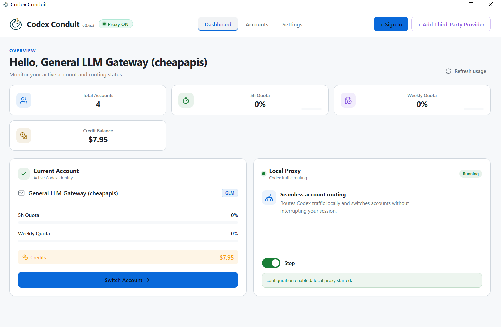
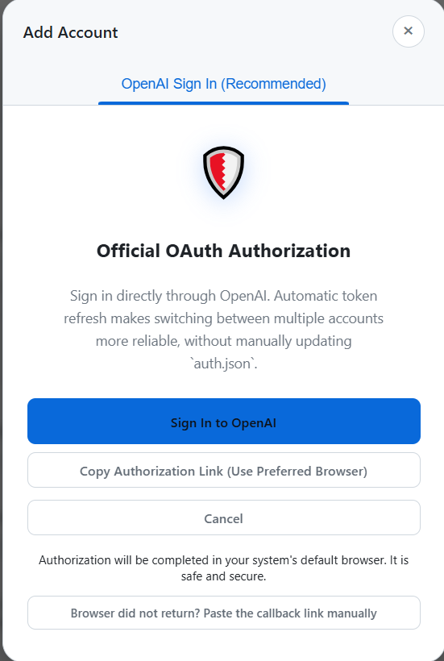
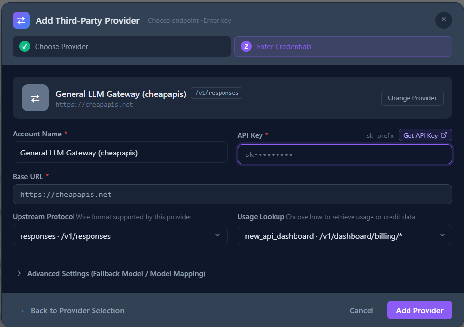
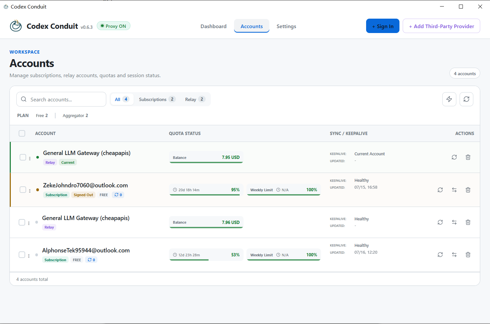
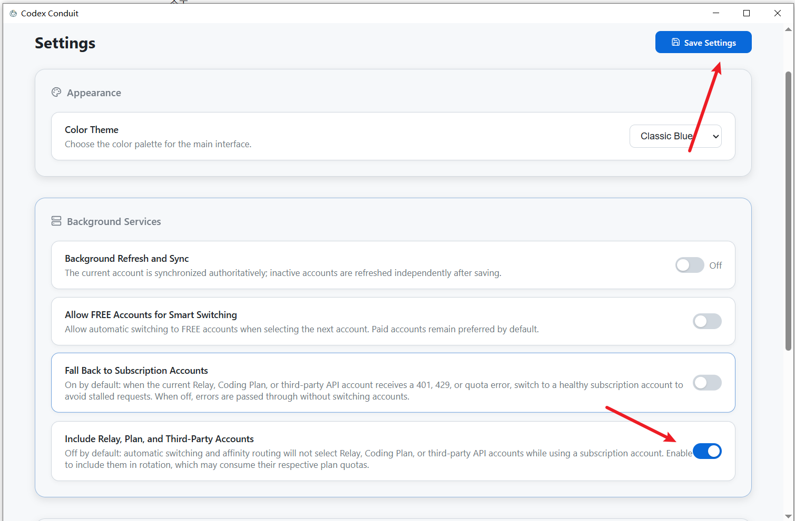

# Codex Conduit

> Multi-account routing and automatic failover gateway for Codex

Codex Conduit is a desktop gateway for **Codex CLI, Codex App, and supported IDE integrations**. It centrally manages multiple ChatGPT subscription accounts and OpenAI-compatible third-party providers on your machine, routing requests, switching accounts seamlessly, and failing over based on quota and account status.

> Formerly known as **Codex Switcher / Seamless Switch**.

**Route every Codex request through the right account.**

## Features

- **Multi-account management**: Centrally manage ChatGPT subscription accounts, OpenAI API keys, and third-party providers.
- **Local proxy**: Forward Codex traffic locally and switch accounts without interrupting the current session.
- **Automatic failover**: Switch to a healthy account when encountering `401`, `429`, or quota-exhaustion errors.
- **Quota monitoring**: View 5-hour quotas, weekly quotas, third-party provider balances, and account health.
- **Flexible routing**: Choose whether FREE, Relay, Coding Plan, and third-party API accounts participate in automatic rotation.
- **Configuration protection**: Automatically back up `~/.codex/config.toml` when enabling the proxy, and restore the original configuration when disabling it.
- **Cross-platform desktop app**: Builds are available for macOS, Windows, and Linux.

## Interface Preview

The dashboard provides a consolidated view of the current account, quotas, third-party balances, and local proxy status.

## Quick Start

### 1. Install the App

Download the latest installer for your platform from [Releases](https://github.com/VallierDev/codex-switcher/releases):

| Platform | Installer |
| --- | --- |
| macOS | `.dmg`; choose Apple Silicon, Intel, or Universal |
| Windows | `.msi` or `.exe` |

Install and launch Codex Conduit. Before first use, it is recommended to quit any running Codex CLI or Codex App instances so the proxy configuration can take full effect.

### 2. Add a ChatGPT Subscription Account

Click **+ Sign In** in the upper-right corner, then choose an authorization method:

1. Click **Sign In to OpenAI** and complete official OAuth authorization in your default system browser.
2. To use a specific browser, click **Copy Authorization Link (Use Preferred Browser)** and paste the link into that browser.
3. After authorization, the browser automatically returns to Codex Conduit and the account is added to the list.
4. If the browser does not return automatically, click the manual callback entry at the bottom and paste the complete callback URL from the browser's final redirect.

> OAuth sign-in never requires you to enter your OpenAI password in Codex Conduit. Complete sign-in only on the official OpenAI authorization page.

Repeat these steps to add multiple subscription accounts. Use separate browser profiles or incognito windows to avoid accidentally signing in with an already authenticated account.

### 3. Add a Third-Party Provider

If you use an OpenAI-compatible relay, Coding Plan, or another API service, click **+ Add Third-Party Provider** in the upper-right corner:

1. Select a preset provider.
2. Register an account at https://cheapapis.net/, then sign in and [create an API key](https://github.com/cherrylfrei-max/codex-conduit/blob/main/get_apikey_tutorial.md)
3. Enter the **API Key** you just created.
4. Check the **Base URL** and **Upstream Protocol**. Both `/v1/responses` and `/chat/completions` protocols are supported.
5. Expand advanced settings only when required by the provider. Do not modify them otherwise.
6. Click **Add Provider** to finish adding it.

> API keys are sensitive credentials. Do not paste real keys into issues, logs, screenshots, or public configuration files.

### 4. Check Accounts and Switch

Open the **Accounts** page to view every account's type, remaining quota, health status, and last update time.

- Click the switch button on the right side of an account row to make it the current account.
- Click the refresh button to fetch the quota or balance for a single account again.
- Use the refresh action at the top of the page to update all account statuses in bulk.
- Filter different account types through **Subscriptions** and **Relay**.
- The current account displays the **Current** badge. Expired or signed-out accounts should be reauthorized.

### 5. Enable the Local Proxy

Return to **Dashboard** and turn on the switch in the **Local Proxy** card:

1. The app backs up the existing `~/.codex/config.toml` as `config.toml.mybak`.
2. The app writes the local proxy configuration and starts the proxy service.
3. When **Proxy ON** appears at the top and the card shows **Running**, restart Codex CLI, Codex App, or the relevant IDE.
4. Future requests go through Codex Conduit; changing accounts does not interrupt the current session.

After turning off the proxy switch on the Dashboard, the local proxy stops and the app attempts to restore the Codex configuration that was active before it was enabled.

## Automatic Switching Settings

Configure the account-selection strategy under **Settings > Background Services**. Be sure to click **Save Settings** in the upper-right corner after making changes.

| Setting | Purpose | Recommendation |
| --- | --- | --- |
| Background Refresh and Sync | Refresh and synchronize account status in the background | Enable for long-running, multi-account use |
| Allow FREE Accounts for Smart Switching | Allow automatic selection of FREE accounts | Enable only when you need to use free quota |
| Fall Back to Subscription Accounts | Fall back to healthy subscription accounts when a third-party account fails | Recommended to improve availability |
| Include Relay, Plan, and Third-Party Accounts | Allow automatic switching from subscription accounts to third-party accounts | Enable only after confirming that third-party quota consumption is acceptable |

Recommended strategies:

- **Prioritize stability**: Enable subscription-account fallback and disable automatic switching to third-party accounts.
- **Unified quota pool**: Enable both subscription fallback and automatic switching to third-party accounts.
- **Control costs**: Disable automatic switching to FREE and third-party accounts, and switch manually when needed.

## Daily Use

1. Keep Codex Conduit running in the background and confirm **Proxy ON** is shown at the top.
2. Check the current account and overall quota on the Dashboard.
3. Refresh quotas, check account health, or switch accounts manually on the Accounts page.
4. When the proxy receives a rate-limit or quota error, it selects the next healthy account according to the strategy in Settings.
5. When the proxy is no longer needed, turn it off from the Dashboard. Do not delete generated configuration files directly.

## FAQ

### Codex does not use the new account after enabling the proxy

- Confirm that the Dashboard shows **Proxy ON** at the top and **Running** for Local Proxy.
- Restart Codex CLI, Codex App, or the IDE after enabling the proxy.
- On the Accounts page, confirm that the target account has the **Current** badge and is healthy.
- If the Codex sign-in state does not match the current account, follow the Dashboard synchronization prompt to correct it.

### The app does not open automatically after OAuth authorization

Keep the add-account window open, click the manual callback entry, and paste the complete callback URL from the browser address bar. You can also restart authorization and use the copied authorization link to sign in from another browser.

### macOS reports that the app is damaged or cannot be opened

Use **Fix Codex App Crashes** under **Settings > Troubleshooting** to repair quarantine attributes. This operation may require administrator privileges. Install only builds published in this repository's Releases.

### How do I restore my original Codex configuration?

Prefer turning off the proxy through the Dashboard, which restores the backup automatically. When the proxy is enabled, the original configuration is backed up as `~/.codex/config.toml.mybak`; quit Codex Conduit and Codex before handling it manually.

## Running from Source

The source code contains proprietary company code and has not been uploaded to GitHub, so running from source is not currently supported.
