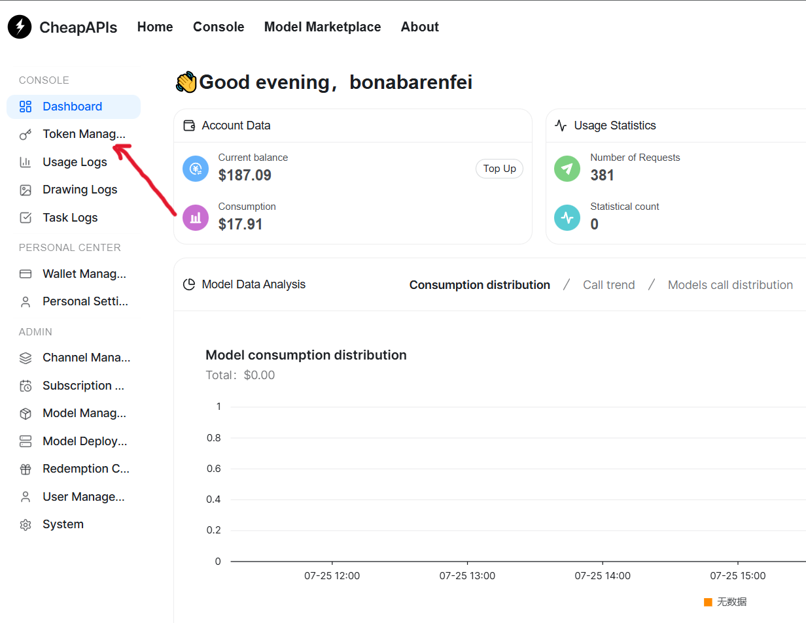
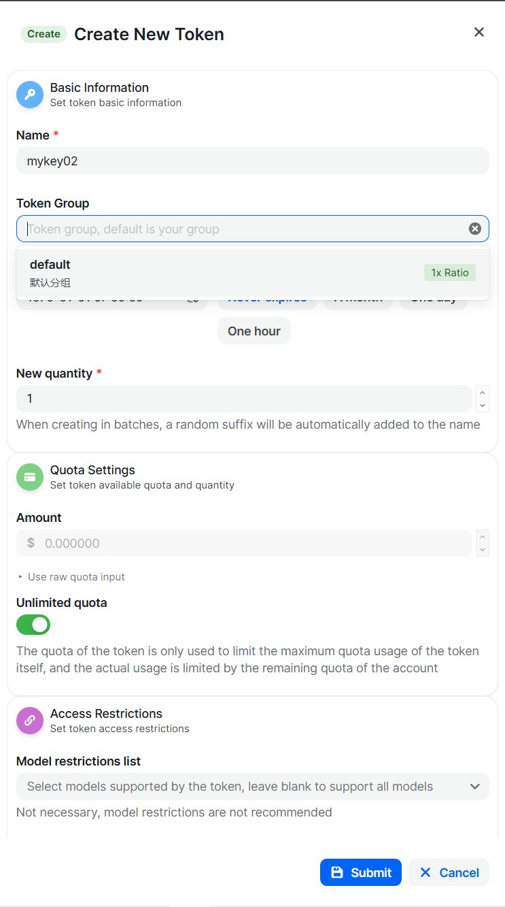
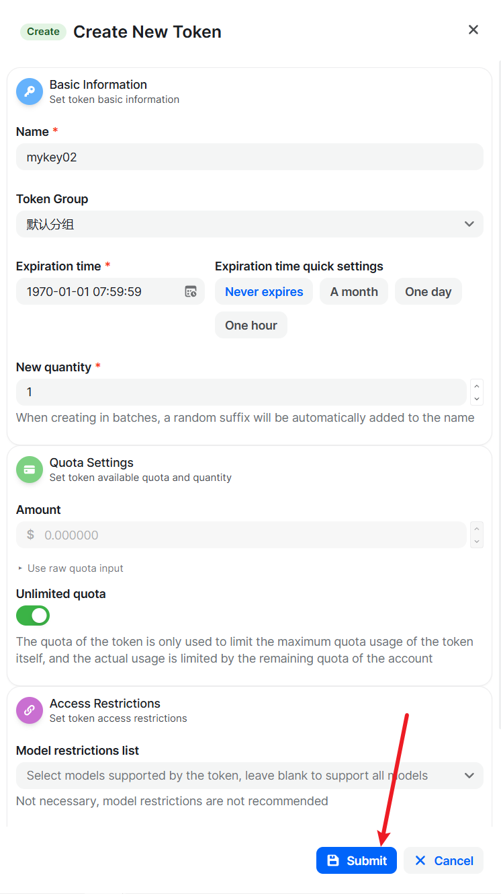

# 获取 API Key 教程

本教程介绍如何在控制台创建并复制 API Key。控制台界面中的 **Token** 即 API Key，用于在客户端、脚本或第三方应用中调用 API。

> 请妥善保管 API Key。不要将其提交到 Git 仓库、发送到公开聊天记录，或直接写入前端代码。

## 1. 进入令牌管理

登录控制台后，在左侧导航栏点击 **Token Management**，进入 API Key 管理页面。



## 2. 创建新的 API Key

在 Token Management 页面右上角点击 **Create token**。


## 3. 配置 Token

在创建页面中填写并确认以下配置：

- **Name**：填写便于识别的名称，例如 `my-app-production` 或 `local-development`。
- **Token Group**：选择有权调用目标模型的分组。
- **Expiration Date**：按需设置有效期；仅用于临时测试时，建议设置较短的过期时间。
- **Remaining Quota**：按需限制此 API Key 可使用的额度，避免单个密钥意外消耗过多配额。
- **Model Limit**：如只需调用特定模型，可在此限制可访问的模型范围。

其中，名称和分组通常为必填项；其余项目请根据实际使用场景设置。



## 4. 提交创建

确认配置无误后，点击页面底部的 **Submit** 创建 API Key。



## 5. 复制 API Key

创建成功后回到 Token Management 列表，在目标 Token 的操作菜单中选择 **Copy Key**，即可复制 API Key。


建议将 API Key 保存到密码管理器或服务器环境变量中。例如：

```bash
export OPENAI_API_KEY="你的 API Key"
```

完成后，可将该 API Key 配置到支持 OpenAI 兼容接口的客户端、SDK 或应用中使用。若怀疑密钥泄露，请立即在 Token Management 中禁用或删除该 Token，并重新创建新的 API Key。
